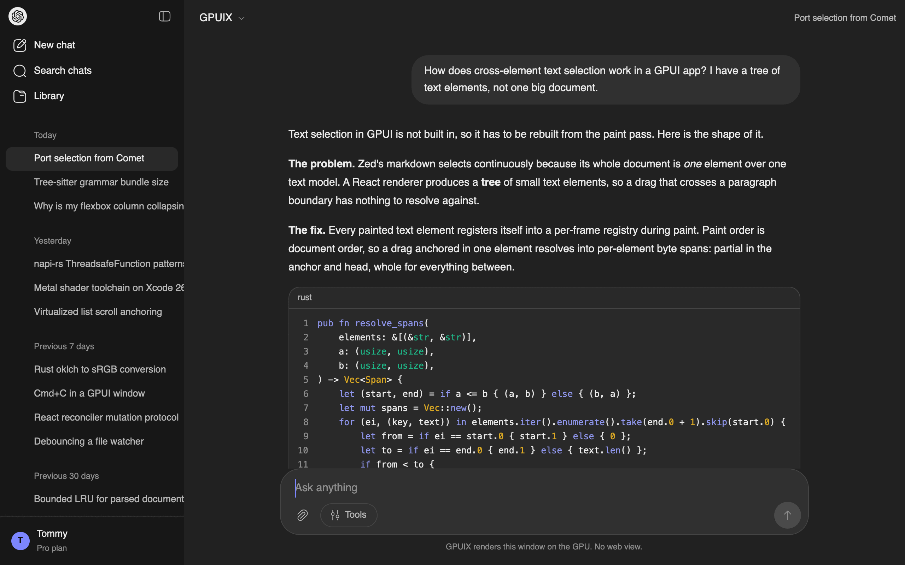
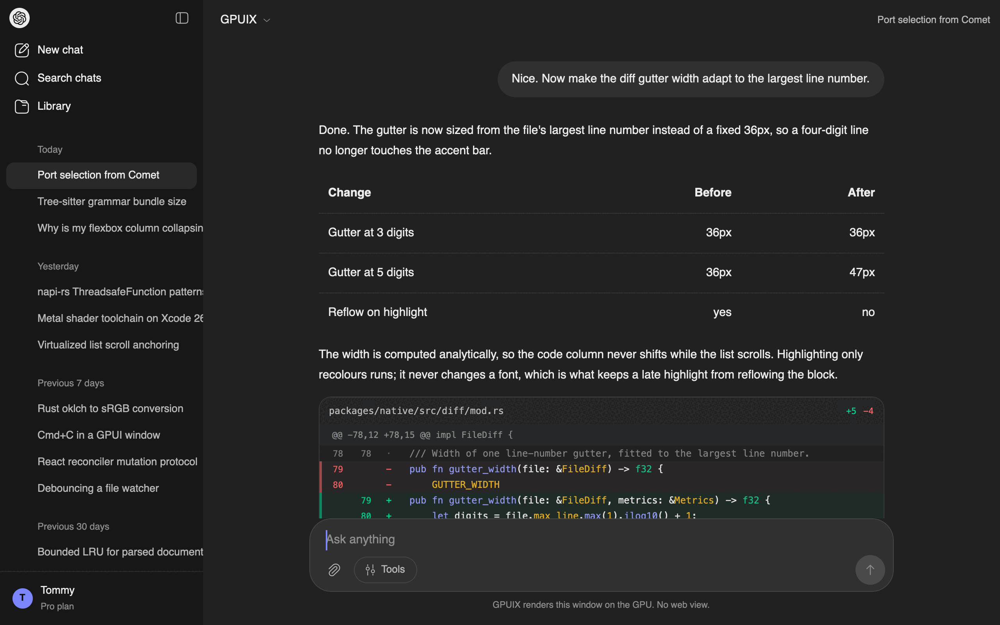
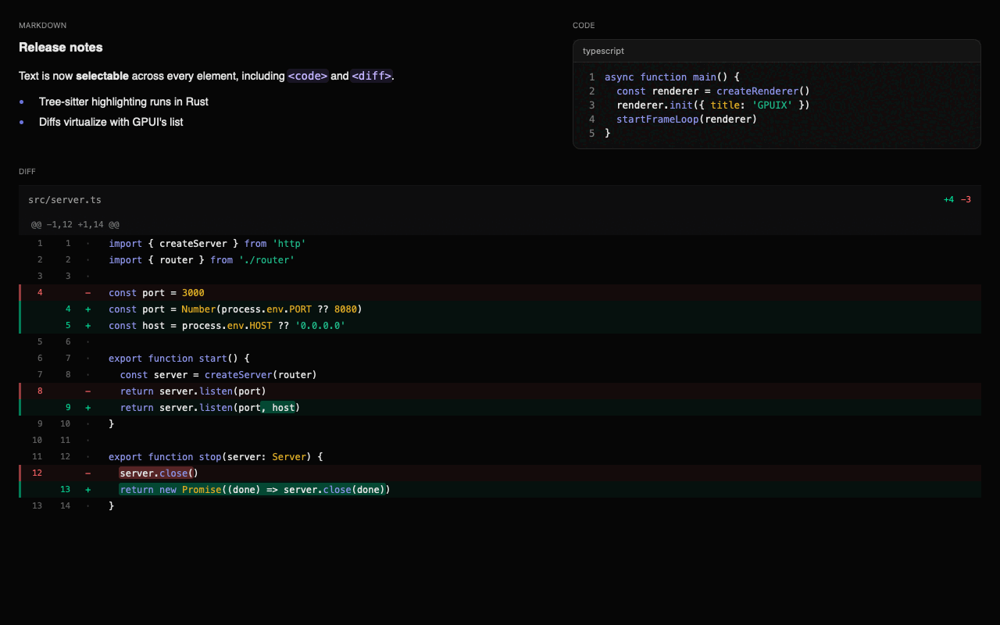
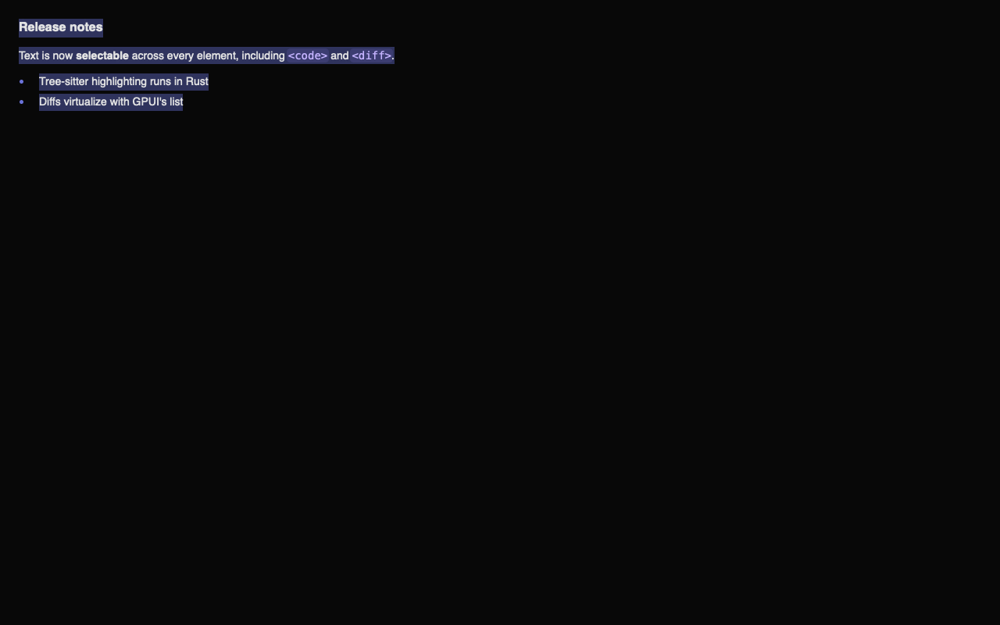
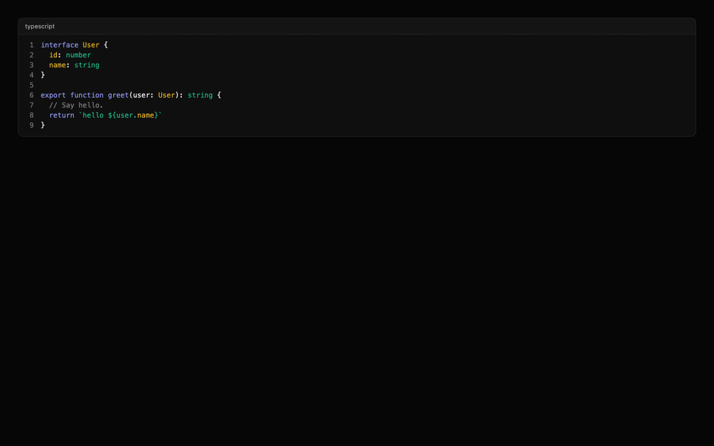
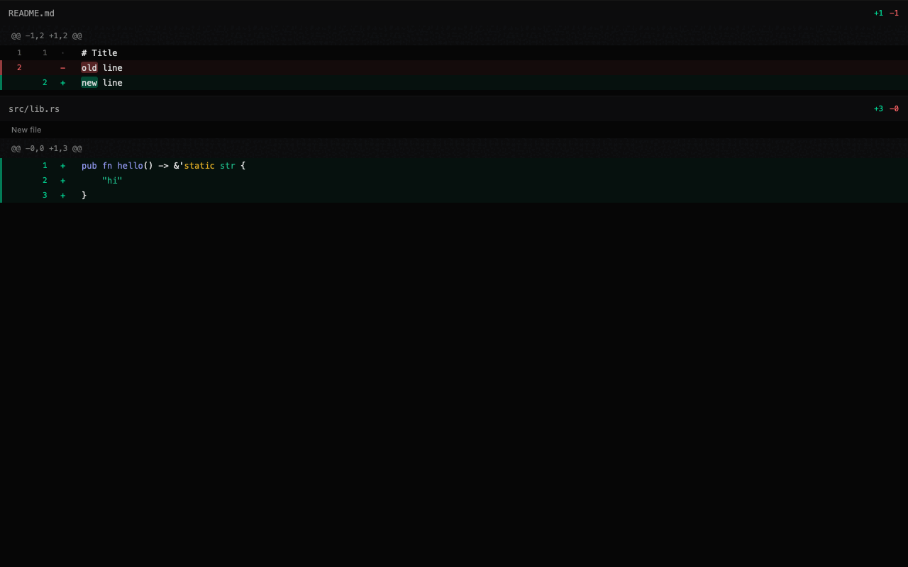
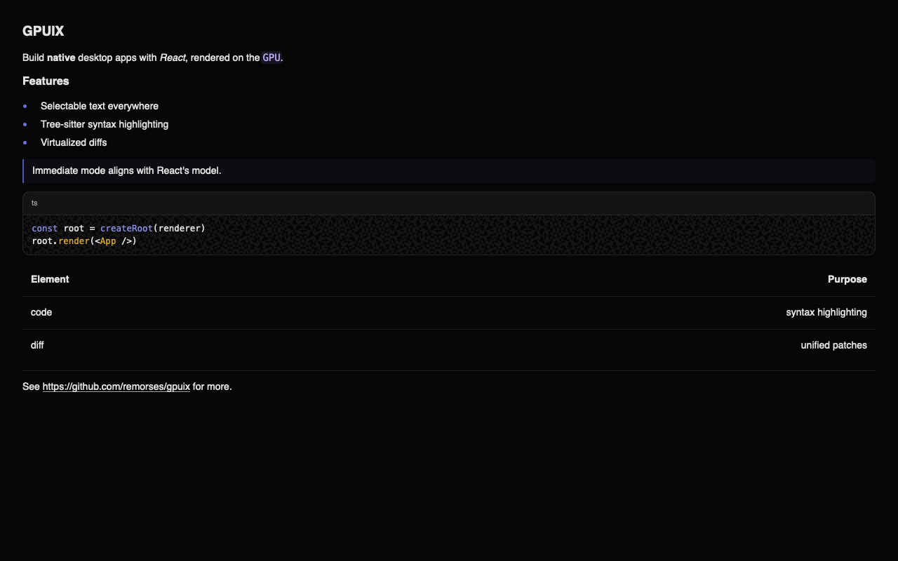
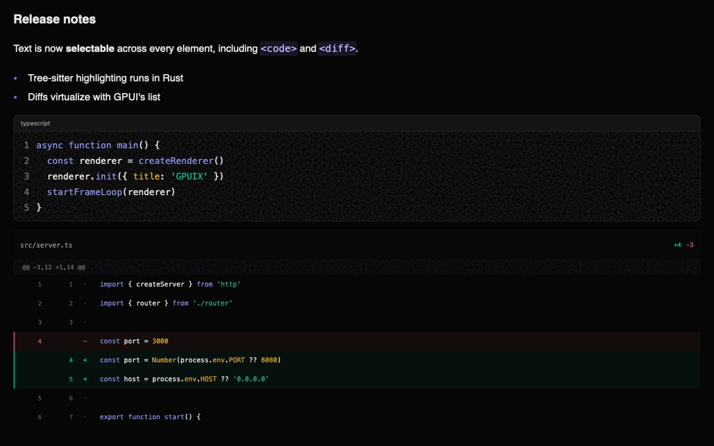

# GPUIX

React bindings for [GPUI](https://github.com/zed-industries/zed/tree/main/crates/gpui) - Zed's GPU-accelerated UI framework.

Build native GPU-accelerated desktop apps with React and TypeScript. Your components render directly to the GPU via Metal, DirectX, or Vulkan. No Electron, no web views.



Everything above is GPUIX: the sidebar, the scrolling transcript, the composer,
and the syntax-highlighted code block. Run it with
`cd examples && bun run chat`.

## Examples

| Example | Run | What it shows |
|---|---|---|
| **chat** | `bun run chat` | A full ChatGPT-style app: sidebar, transcript, composer, `<markdown>`, `<code>`, `<diff>` |
| **native-text** | `bun run native-text` | The three native text components with a tab switcher |
| **counter** | `bun run counter` | The smallest possible app: state, events, hover |
| **diff** | `bun run diff` | A diff viewer composed from `<div>` and `<text>` in JS, for comparison |

All of them live in [`examples/`](./examples) and use hardcoded data.

The chat example puts a virtualized `<diff>` and a GFM table inside an assistant
turn, inside a scrolling transcript:



Markdown, code and a virtualized diff in one frame:



## Architecture

GPUIX bridges React to GPUI using a **mutation-based protocol** over napi-rs FFI. React's reconciler sends individual DOM-like mutations (`createElement`, `appendChild`, `setStyle`, etc.) directly to Rust — no JSON tree serialization. Rust maintains a retained element tree that GPUI reads each frame.

```
┌─────────────────────────────────────────────────────────────────┐
│  React (JavaScript)                                             │
│                                                                 │
│  function App() {                                               │
│    const [count, setCount] = useState(0)                        │
│    return (                                                     │
│      <div style={{ display: 'flex', gap: 8 }}>                  │
│        <div onClick={() => setCount(c => c + 1)}>               │
│          Count: {count}                                         │
│        </div>                                                   │
│      </div>                                                     │
│    )                                                            │
│  }                                                              │
└─────────────────────────────────────────────────────────────────┘
                    │ napi FFI mutations
                    │ createElement(1, "div")
                    │ appendChild(0, 1)
                    │ setStyle(1, "{...}")
                    │ commitMutations()
                    ▼
┌─────────────────────────────────────────────────────────────────┐
│  Rust (napi-rs)                                                 │
│                                                                 │
│  RetainedTree ── stores elements, styles, event flags           │
│       │                                                         │
│       ▼  each GPUI frame                                        │
│  GpuixView::render() → build_element() → GPUI elements         │
└─────────────────────────────────────────────────────────────────┘
                    │
                    ▼
┌─────────────────────────────────────────────────────────────────┐
│  GPUI                                                           │
│                                                                 │
│  GPU rendering via Metal (macOS), DirectX (Windows), or Vulkan  │
│  Flexbox layout via Taffy                                       │
└─────────────────────────────────────────────────────────────────┘
```

## Why This Works

GPUI is an **immediate-mode** UI framework — it rebuilds the entire element tree every frame. Instead of fighting this, GPUIX embraces it:

1. React reconciler detects a state change and calls napi mutations (`createElement`, `setStyle`, `appendChild`, etc.)
2. Each mutation updates a **RetainedTree** on the Rust side — a HashMap of element nodes with styles, children, and event flags
3. On each GPUI frame, `GpuixView::render()` walks the RetainedTree and calls `build_element()` to produce ephemeral GPUI elements
4. GPUI lays them out (Taffy flexbox) and renders to the GPU
5. Only **changed elements** cross the FFI boundary — React's reconciler diffs the virtual tree and sends minimal mutations

This is the same protocol React uses for the DOM (`createElement`, `appendChild`, `removeChild`, `commitUpdate`), but targeting a GPU renderer instead of a browser.

## Mutation API

The FFI surface between JS and Rust is a set of direct napi calls — the `NativeRenderer` interface:

```ts
interface NativeRenderer {
  createElement(id: number, elementType: string): void
  destroyElement(id: number): Array<number>
  appendChild(parentId: number, childId: number): void
  removeChild(parentId: number, childId: number): void
  insertBefore(parentId: number, childId: number, beforeId: number): void
  setStyle(id: number, styleJson: string): void
  setText(id: number, content: string): void
  setEventListener(id: number, eventType: string, hasHandler: boolean): void
  setRoot(id: number): void
  commitMutations(): void
}
```

Element IDs are plain numbers generated by an incrementing counter in JS. `commitMutations()` signals the end of a batch — Rust marks the view dirty so GPUI re-renders on the next frame.

## Event Flow

Events travel from GPUI back to React through a `ThreadsafeFunction` callback:

```
User clicks element id=3
       │
       ▼
GPUI fires on_click on the element
       │
       ▼
Rust closure calls emit_event_full(callback, 3, "click", {x, y, ...})
       │
       ▼
ThreadsafeFunction queues EventPayload on Node.js event loop
       │
       ▼
JS event registry: eventHandlers.get(3)?.get("click")?.(payload)
       │
       ▼
React handler runs: onClick={() => setCount(c => c + 1)}
       │
       ▼
State update triggers re-render → reconciler sends mutations back to Rust
```

Event handlers are stored in a JS-side registry keyed by `(elementId, eventType)`. Rust only knows **whether** an element has a listener (via `setEventListener`), not the closure itself — the actual handler lives in JS.

## Packages

- **`@gpuix/native`** — Rust/napi-rs bindings to GPUI. Contains `GpuixRenderer`, `RetainedTree`, `build_element()`, `apply_styles()`, and the event wiring.
- **`@gpuix/react`** — React reconciler, event registry, and TypeScript types. Implements the `react-reconciler` host config using the mutation API.

## Building

### Prerequisites

1. Rust toolchain
2. Node.js 18+
3. Xcode with Metal Toolchain (macOS)

```bash
# Install Metal Toolchain if needed
xcodebuild -downloadComponent MetalToolchain

# Install dependencies
bun install

# Check out the pinned GPUI fork
git submodule update --init --recursive

# Build native package
cd packages/native
bun run build

# Build React package
cd ../react
bun run build

# Run example (use tmux for long-running sessions)
cd ../../examples
npx tsx counter.tsx
```

## Usage

```tsx
import React, { useState } from 'react'
import { createRoot, createRenderer, flushSync, startFrameLoop } from '@gpuix/react'

function App() {
  const [count, setCount] = useState(0)
  return (
    <div style={{ display: 'flex', gap: 8, padding: 16 }}>
      <div
        style={{ backgroundColor: '#3b82f6', borderRadius: 8, padding: 12, cursor: 'pointer' }}
        onClick={() => setCount(c => c + 1)}
      >
        <div style={{ color: '#ffffff' }}>Count: {count}</div>
      </div>
    </div>
  )
}

// Create the native renderer with event callback
const renderer = createRenderer((event) => {
  console.log('Event:', event.elementId, event.eventType)
})

// Initialize GPUI (non-blocking — returns immediately)
renderer.init({ title: 'My App', width: 800, height: 600 })

// Create React root and render
const root = createRoot(renderer)
flushSync(() => root.render(<App />))

// Drive AppKit on macOS. This is a no-op on Windows and Linux.
startFrameLoop(renderer)
```

On **macOS**, `startFrameLoop` calls `renderer.tick()` at a fixed rate (~125fps by
default). This pumps AppKit on the process main thread without blocking Node. Pass
`{ frameMs }` to change the rate, and call `.stop()` on the returned handle to end it.

On **Windows and Linux**, GPUI runs its normal blocking native event loop on one
dedicated Rust UI thread. Node sends in-process commands to that thread, so
`startFrameLoop` returns a no-op handle and does not create a JavaScript timer.
All platforms use GPUI's native platform, window, renderer, input, scroll,
clipboard, keyboard, and IME implementations. The embedded macOS run-loop
extension comes from the pinned GPUIX fork. Windows runtime validation is pending.

> [!IMPORTANT]
> On macOS, never drive `tick()` from a `setImmediate` loop. That spins at tens of thousands of
> ticks per second and burns **73% CPU on a completely idle app**, versus **1%** when
> paced.

## Scrolling

Containers with `overflow: "scroll"` become natively scrollable — GPUI handles scroll physics, clipping, and offset persistence automatically.

```tsx
function ScrollableList() {
  return (
    <div style={{ height: 300, overflow: 'scroll' }}>
      {items.map((item, i) => (
        <div key={i} style={{ height: 60, padding: 12 }}>
          {item.name}
        </div>
      ))}
    </div>
  )
}
```

Per-axis scrolling: use `overflowX: "scroll"` or `overflowY: "scroll"`.

For programmatic scroll control, use a React ref to get the element's numeric ID, then call the renderer's scroll methods:

```tsx
function ProgrammaticScroll() {
  const listRef = useRef<any>(null)

  const jumpToBottom = () => {
    if (listRef.current) {
      renderer.scrollTo(listRef.current.id, 0, -999)
    }
  }

  return (
    <>
      <div ref={listRef} style={{ height: 200, overflow: 'scroll' }}>
        {items.map((item, i) => <div key={i}>{item}</div>)}
      </div>
      <div onClick={jumpToBottom}>Jump to bottom</div>
    </>
  )
}

// Available scroll methods on the renderer:
renderer.scrollTo(elementId, x, y)        // set offset directly
renderer.scrollToItem(elementId, index)   // scroll child into view
renderer.getScrollOffset(elementId)       // returns [x, y] or null
```

## Text input

`<input>` and `<textarea>` use GPUI's platform input handler. They support a
native caret, text selection, IME composition, clipboard actions, undo/redo,
grapheme-safe deletion and mouse positioning.

```tsx
<textarea
  value={draft}
  placeholder="Ask anything"
  minRows={1}
  maxRows={8}
  onChange={(event) => setDraft(event.value ?? '')}
  onSubmit={send}
/>
```

`Enter` emits `onSubmit`. In a `<textarea>`, `Shift+Enter` inserts a newline.
The editor updates natively first, then reports the complete value to React.
`value` changes can replace the native content, but keeping the same prop value
does not reject an edit like a browser-controlled input.

## Text selection

Every text GPUIX paints is **selectable and copyable**, including text inside
`<code>`, `<diff>` and `<markdown>`. A drag that starts in a heading and ends
inside a fenced code block selects everything between; Cmd+C copies it joined in
document order.

There is nothing to opt into. To opt *out* — toolbars, buttons, line-number
gutters — set `userSelect: "none"`, which inherits like the CSS property:

```tsx
<div style={{ userSelect: 'none' }}>
  <text>toolbar label, never selected</text>
</div>
```



Read the selection from the renderer:

```tsx
renderer.getSelectedText()   // joined text, or null
renderer.clearSelection()
```

Selection works because each painted text element registers itself into a
per-frame registry in **paint order**, which is document order. A drag anchored
in one element resolves against that registry into per-element spans: partial in
the anchor and head, whole for everything between.

<details>
<summary>Why not one big text element, like Zed?</summary>

Zed's markdown selects continuously because its whole document is a single
element over one text model. GPUIX renders a *tree* of text elements, so it
rebuilds that continuity at paint time instead. The mechanism is ported from
[Comet](https://github.com/zeronsh/comet) (MIT), which faced the same problem.
</details>

## Native text components

Three elements render text with Tree-sitter syntax highlighting computed in
Rust. Colours come from a theme prop, so a late-arriving highlight recolours runs
without ever changing layout.

### `<code>`

A syntax-highlighted code block. One row per line at an exact line height, so the
block's height is known before highlighting runs.

```tsx
<code
  code={source}
  language="typescript"        // or path="src/app.ts" to detect from extension
  showLineNumbers
  showHeader={false}
/>
```



### `<diff>`

A unified diff viewer, virtualized with GPUI's `list()`. Collapsing a file
removes its rows rather than hiding them, so a collapsed 10k-line file costs one
row.

```tsx
<diff
  patch={unifiedPatch}
  wordDiff                     // highlight only the tokens that changed
  collapsedPaths={['pnpm-lock.yaml']}
  onToggleFile={(e) => toggle(e.value)}
  onLineClick={(e) => console.log(e.oldLine, e.newLine, e.value)}
/>
```



### `<markdown>`

GitHub-flavoured markdown: headings, lists, tables, block quotes, fenced code,
strikethrough, task lists, and autolinked bare URLs.

```tsx
<markdown source={readme} onLinkClick={(e) => open(e.value)} />
```



### Theming

All three take the same optional `theme` prop. Every field layers on top of the
built-in dark theme, so overriding one token leaves the rest alone.

```tsx
<code
  code={source}
  language="rust"
  theme={{
    appearance: 'dark',        // or 'light'
    accent: '#7c86ff',
    syntax: { keyword: '#f38ba8', string: '#a6e3a1' },
  }}
/>
```

**Layout numbers live in the theme too**, under `metrics`. Row heights, gutter
widths, paddings and the heading scale are props, not Rust constants, so tuning
the design is a React re-render and never a native rebuild.

```tsx
<diff
  patch={patch}
  theme={{
    metrics: {
      diffLineHeight: 26,
      diffGutterWidth: 48,
      mdHeadingSizes: [24, 19, 16, 14],
    },
  }}
/>
```

`<diff>` virtualizes from these numbers without measuring, so changing
`diffLineHeight` also re-sizes the scroll model.

The same three components, retuned entirely from `metrics` with no rebuild:



Languages bundled: Rust, TypeScript, TSX, JavaScript, JSX, Python, Go, JSON,
Bash, TOML, YAML, Markdown, HTML, CSS, C.

## Supported Elements

| Element     | Description                                      |
|-------------|--------------------------------------------------|
| `div`       | Container with flexbox layout                    |
| `text`      | Text content, selectable                         |
| `code`      | Syntax-highlighted code block                    |
| `diff`      | Virtualized unified diff viewer                  |
| `markdown`  | GitHub-flavoured markdown                        |
| `input`     | Native single-line text editor                   |
| `textarea`  | Native multiline, auto-growing text editor       |
| `img`       | Images                                           |
| `anchored`  | Positioned overlay                               |
| `svg`       | Tintable SVGs loaded from local files            |
| `canvas`    | Custom drawing (planned)                         |

SVGs use GPUI's monochrome icon renderer. Set the local file path with `src`,
the size with `width` and `height`, and the tint with `color`:

```tsx
<svg
  src="/absolute/path/to/search.svg"
  style={{ width: 16, height: 16, color: '#b4b4b4' }}
/>
```

## Supported Events

| Event | Props | Payload fields |
|-------|-------|----------------|
| Click | `onClick` | `x`, `y`, `clickCount`, `isRightClick`, `modifiers` |
| Mouse down | `onMouseDown` | `x`, `y`, `button`, `clickCount`, `modifiers` |
| Mouse up | `onMouseUp` | `x`, `y`, `button`, `clickCount`, `modifiers` |
| Mouse enter | `onMouseEnter` | `hovered` |
| Mouse leave | `onMouseLeave` | `hovered` |
| Mouse move | `onMouseMove` | `x`, `y`, `pressedButton`, `modifiers` |
| Click outside | `onMouseDownOutside` | `x`, `y`, `button`, `modifiers` |
| Key down | `onKeyDown` | `key`, `keyChar`, `isHeld`, `modifiers` |
| Key up | `onKeyUp` | `key`, `keyChar`, `modifiers` |
| Focus | `onFocus` | — |
| Blur | `onBlur` | — |
| Scroll | `onScroll` | `deltaX`, `deltaY`, `precise`, `touchPhase`, `modifiers` |
| Change | `onChange` | `value` — `<input>` and `<textarea>` only |
| Submit | `onSubmit` | `value` — `<input>` and `<textarea>` only |
| Toggle file | `onToggleFile` | `value` (file path) — `<diff>` only |
| Line click | `onLineClick` | `value`, `oldLine`, `newLine` — `<diff>` only |
| Link click | `onLinkClick` | `value` (URL) — `<markdown>` only |

Keyboard and focus events require the element to be focusable (has `onKeyDown`, `onKeyUp`, `onFocus`, or `onBlur` listeners). GPUI creates a `FocusHandle` automatically for these elements.

## Supported Styles

CSS-like styling via the `style` prop:

```tsx
<div style={{
  display: 'flex',
  flexDirection: 'column',
  gap: 8,
  padding: 16,
  backgroundColor: '#3b82f6',
  borderRadius: 8,
}}>
  <div style={{ color: '#ffffff', fontSize: 18 }}>
    Hello GPUI!
  </div>
</div>
```

**Layout:** `display`, `flexDirection`, `flexGrow`, `flexShrink`, `alignItems`, `justifyContent`, `gap`

**Sizing:** `width`, `height`, `minWidth`, `minHeight`, `maxWidth`, `maxHeight` — accepts pixels (number) or percentages (string like `"100%"`)

**Spacing:** `padding`, `paddingTop/Right/Bottom/Left`, `margin`, `marginTop/Right/Bottom/Left`

**Visual:** `backgroundColor`, `color`, `opacity`, `cursor`, `borderRadius`, `borderWidth`, `borderColor`

**Overflow:** `overflow`, `overflowX`, `overflowY` — `"hidden"` clips content, `"scroll"` creates a native scrollable container with persistent scroll state

**Text:** `fontSize`, `fontFamily`, `fontWeight`, `whiteSpace`, `textOverflow`, `lineClamp`

**Selection:** `userSelect` (`"text"` | `"none"`), `selectionColor` — both inherit down the tree

> **Note: `white-space: pre` is not supported.** GPUI's text system only has `normal` (wraps) and `nowrap` (single line). To preserve newlines like HTML `<pre>`, split your text on `\n` in React and render each line as a separate `<text>` element in a flex column:
>
> ```tsx
> <div style={{ display: 'flex', flexDirection: 'column', fontFamily: 'Menlo' }}>
>   {code.split('\n').map((line, i) => (
>     <text key={i} style={{ whiteSpace: 'nowrap' }}>{line}</text>
>   ))}
> </div>
> ```

> **Note: GPUI defaults text color to black, not white.** Unlike CSS, GPUI does not inherit `color` from parent elements. Every `<text>` element that doesn't set an explicit `color` style will render as black — invisible on dark backgrounds. Always set `color` on your text elements or on a parent `<div>` (which applies `text_color` to all children in that subtree via GPUI's `Styled` trait).

## Testing

GPUIX includes a **GPU-backed test renderer** (`TestGpuixRenderer`) that runs the full GPUI rendering pipeline — same `GpuixView`, `build_element()`, `apply_styles()`, and event handlers as production. Windows are positioned offscreen but fully rendered by Metal.

```ts
import { createTestRoot } from '@gpuix/react/testing'

const { root, renderer } = createTestRoot()

root.render(<MyComponent />)
renderer.flush()  // triggers GpuixView::render() via Metal

// Simulate events through GPUI's native input pipeline
renderer.nativeSimulateClick(50, 50)
renderer.nativeSimulateKeystrokes('enter')

// Inspect results
const events = renderer.drainNativeEvents()
const screenshot = renderer.captureScreenshot('/tmp/test.png')
const text = renderer.getAllText()
```

### Testing native elements

`getAllText()` only sees `<text>` nodes in the retained tree. `<code>`, `<diff>`
and `<markdown>` paint their text inside GPUI, so use `getPaintedText()`, which
returns every string painted in the last frame in paint order:

```ts
root.render(<code code={'a\nb'} language="ts" showHeader={false} />)
expect(renderer.getPaintedText()).toEqual(['a', 'b'])
```

Selection has its own helper. Listeners are registered during **paint**, so
`dragSelect` flushes between every step; calling `simulateMouseDown` / `Move` /
`Up` by hand without those flushes selects nothing:

```ts
expect(renderer.dragSelect(20, 30, 900, 300)).toBe('first line\nsecond line')
```

Screenshots land in `packages/react/screenshots/` and `examples/screenshots/`,
both gitignored, so they can be inspected after a run without adding a binary
diff to every commit. The curated set the README links to lives in
`docs/images/` and is regenerated with:

```bash
bun scripts/screenshots.ts
```

## Developing the Rust side

There is **no hot reload for the native half**, and there cannot be: `require()`
of a `.node` file calls `process.dlopen`, Node has no matching unload, and the
live state (GPUI's platform, GPU device, open window, UI thread, and selection
registry) stays inside the loaded library. A second load would create independent
native state while the first library remains loaded.

The rebuild is fast enough that it does not matter. Measured on an M-series Mac
after touching one file:

| Step | Time |
|---|---|
| `cargo check --lib` | 1.5s |
| `cargo build --lib` | 4.9s |
| `bun run build:debug` (napi) | ~2s |
| One vitest screenshot file | ~2s |

`bun run dev` wires that into a loop: it watches `packages/native/src`,
rebuilds, and re-renders the screenshot tests. **Rust edit to fresh PNGs is
about 4 seconds.**

```bash
bun run dev                      # rebuild, re-render the showcase screenshots
bun scripts/dev.ts --shots diff  # only tests matching "diff"
bun scripts/dev.ts --app native-text   # rebuild, restart an example app
```

Screenshot mode is the better default. Open
`packages/react/screenshots/showcase.png` in Preview.app, which reloads on
write, and unlike a live window the PNG can also be read by an agent.

Two things avoid the rebuild entirely:

- **Content** already lives in props. Change `patch` or `source` and the next
  frame shows it.
- **Design numbers** live in `theme.metrics`. Tuning a row height or heading
  scale is a React re-render.

The test renderer uses `VisualTestAppContext` with a `TestDispatcher` for deterministic scheduling. Event simulation goes through GPUI's coordinate-based hit testing and dispatch — not synthetic JS events.

## Status

- [x] React reconciler with mutation-based protocol
- [x] napi-rs FFI bindings (createElement, appendChild, setStyle, etc.)
- [x] RetainedTree (Rust-side element storage)
- [x] Style mapping (CSS properties → GPUI style methods)
- [x] Mouse events (click, mouseDown, mouseUp, mouseMove, mouseEnter, mouseLeave)
- [x] Click outside (`onMouseDownOutside`)
- [x] Scroll wheel events with delta and touch phase
- [x] Scrollable containers (`overflow: "scroll"`) with persistent scroll state
- [x] Programmatic scroll API (`scrollTo`, `scrollToItem`, `getScrollOffset`)
- [x] Keyboard events (keyDown, keyUp) with focus management
- [x] Focus/blur events with automatic FocusHandle creation
- [x] GPU-backed test renderer with screenshot capture
- [x] Standalone build (pinned GPUI platform dependencies)
- [x] Native text input and multiline textarea
- [ ] Image and SVG elements
- [ ] Multiple windows
- [ ] Hot reload
- [ ] Animations

## Documentation

See [AGENTS.md](./AGENTS.md) for detailed architecture, communication flow, and contributing guide.

## License

Apache-2.0
